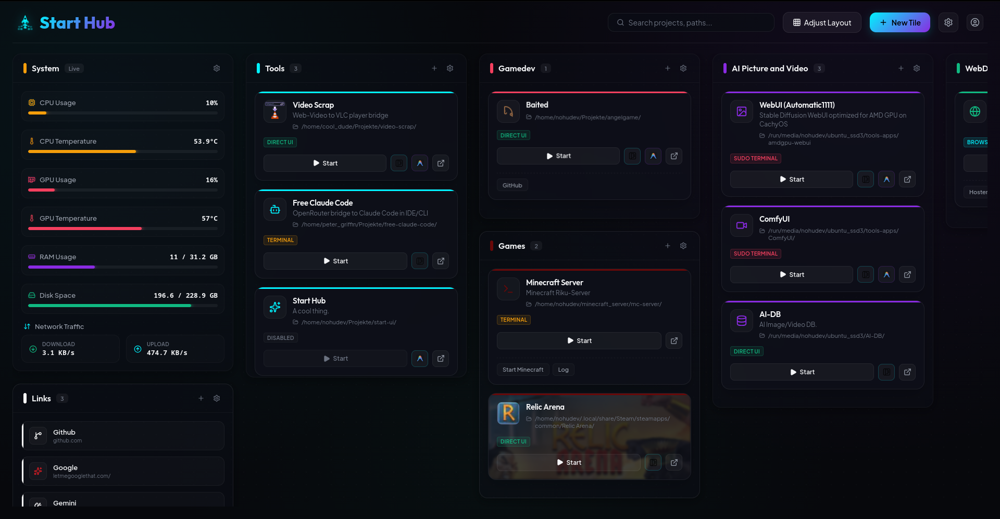

<p align="left">
  
</p>

Start Hub is a centralized development dashboard and project launcher designed to manage, launch, and monitor local applications, system utilities, and development workspaces.

---

> [!WARNING]
> **AI-Assisted Project**: This tool was built in collaboration with AI, utilizing the **Gemini 3.5 Flash** model.



## Features

* **Multi-Mode Launcher**: Start scripts, system tools, or web links with one click. Supports standard, sudo, and detached daemon (background) executions in native terminals.
* **IDE & File Manager Integration**: Open project directories in your favorite IDEs (VS Code, Cursor, Code OSS, etc.) or system file manager directly from the dashboard.
* **Real-Time Telemetry**: Lightweight hardware monitoring widgets for CPU, GPU (with AMDGPU sysfs support), RAM, storage, and network speed.
* **Customizable Grid**: Drag-and-drop dashboard columns, custom category colors, and customizable layout arrangements.
* **Multi-Language Support**: Complete internationalization (English, German, French, Spanish) with auto-locale detection.

---

## Technical Stack

* **Frontend**: React 19, TypeScript, Vite 8, Lucide Icons, and Vanilla CSS (Glassmorphism design, responsive layouts).
* **Backend**: Node.js, Express. Spawns native shell terminal processes and reads telemetry directly from `/proc` and `/sys` to maintain low system overhead.
* **Storage**: Local JSON persistence (`backend/data/projects.json`). Saved configurations are kept local and ignored by Git.

---

## Installation & Launch

### Linux

1. **Install Dependencies**:
   ```bash
   chmod +x install.sh
   ./install.sh
   ```
   *This installs dependencies and registers a desktop application entry in `~/.local/share/applications/start-hub.desktop`.*

2. **Start the Dashboard**:
   ```bash
   ./start.sh
   ```
   *Launches the Express API and Vite frontend server concurrently. Accessible at `http://localhost:5173`.*

3. **Update**:
   ```bash
   ./update.sh
   ```

### Windows

1. **Install**:
   ```cmd
   install.bat
   ```
2. **Start**:
   ```cmd
   start.bat
   ```
3. **Update**:
   ```cmd
   update.bat
   ```

---

## Configuration

### Project Launch Modes

| Mode | Behavior | Best Used For |
| :--- | :--- | :--- |
| **Terminal** | Opens the project command in an interactive host terminal window. | CLI tools, dev servers, compilers |
| **Terminal (Sudo)** | Prepends `sudo` and launches in a host terminal window. | System commands, service management |
| **Direct** | Spawns the process as a detached background daemon. | AppImages, desktop launchers, web browser targets |
| **Browser** | Opens a web URL or host link in your system default browser. | Web UIs, hosted services, document links |
| **Disabled** | Disables clicking, showing only description or logs. | Folder containers, reference lists |

### Local Safefiles
All dashboard configurations are saved in `backend/data/projects.json`. 

---

## Troubleshooting

* **Real-Time GPU Metrics Missing**: Ensure your GPU drivers are active and `/sys/class/drm/card0/device/gpu_busy_percent` is readable.
* **Sudo Commands Failing**: If your sudo commands require password input, the terminal launcher will await input inside the spawned terminal window.
* **Terminal Emulator Not Opening**: If your configured terminal fails to launch, check that its binary is in your system `$PATH`. Start Hub automatically falls back to standard `xterm` if needed.

---

## License

This project is licensed under the MIT License - see the [LICENSE](LICENSE) file for details.

